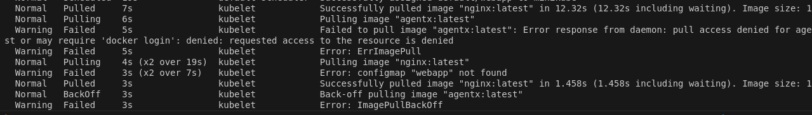
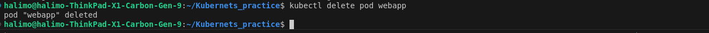
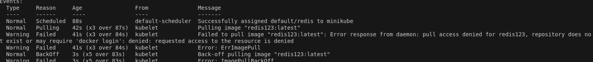
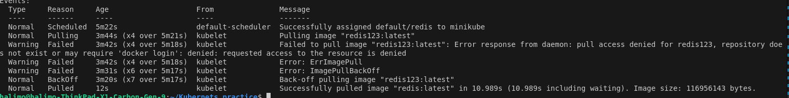
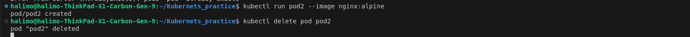

Navigate to https://killercoda.com/login
After sign in go to 
https://killercoda.com/playgrounds/scenario/kubernetes

1- How many pods exist on the system?
0

2- How many Nodes exist on the system?

1
3- Create a new pod with the nginx image.
    Image name: nginx

4- Which nodes are these pods placed on?

5- Create pod from the below yaml using kubectl apply command

apiVersion: v1
kind: Pod
metadata:
  name: webapp
  namespace: default
spec:
  containers:
  - image: nginx
    imagePullPolicy: Always
    name: nginx
  - image: agentx
    imagePullPolicy: Always
    name: agentx

6- How many containers are part of the pod webapp
2

7- What images are used in the new webapp pod?
nginx and agentx
8- What is the state of the container agentx in the pod webapp
waiting

9- Why do you think the container agentx in pod webapp is in error?
imagepullbackoff
image cant be accessed or doesnt exist

10- Delete the webapp Pod.

11- Create a new pod with the name redis and with the image redis123.
•	Name: redis
•	Image Name: redis123

12- Now change the image on this pod to redis.
Once done, the pod should be in a running state.

13- Create a pod called my-pod of image nginx:alpine

14- Delete the pod called my-pod

